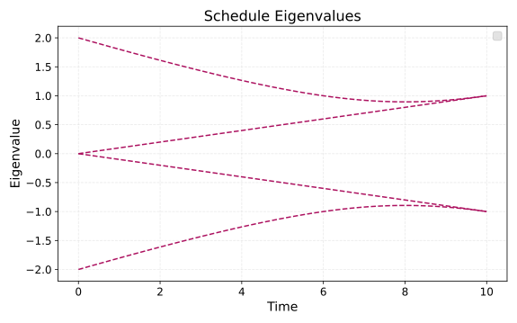
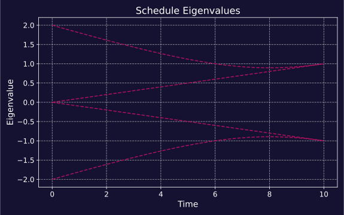
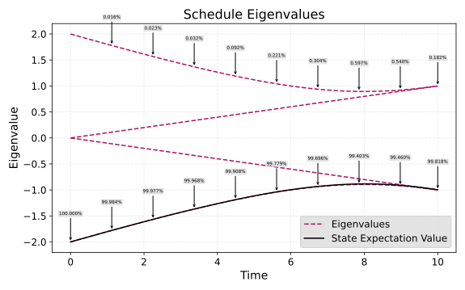
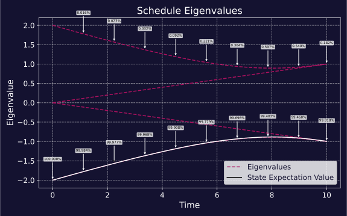

Schedule
--------

The simplest way to construct a common schedule is to use the helper functions:

- :func:`linear <qilisdk.analog.schedule.Schedule.linear>`: Linear interpolation between two Hamiltonians.
- :func:`quadratic <qilisdk.analog.schedule.Schedule.quadratic>`: Quadratic interpolation between two Hamiltonians.
- :func:`polynomial <qilisdk.analog.schedule.Schedule.polynomial>`: Polynomial interpolation of arbitrary degree between two Hamiltonians.
- :func:`sinusoidal <qilisdk.analog.schedule.Schedule.sinusoidal>`: Sinusoidal interpolation between two Hamiltonians.
- :func:`constant <qilisdk.analog.schedule.Schedule.constant>`: Constant coefficient for a single Hamiltonian.
- :func:`chained_linear <qilisdk.analog.schedule.Schedule.chained_linear>`: Linear chaining of multiple Hamiltonians.

For example, to create a linear schedule that interpolates between a driver Hamiltonian and a problem Hamiltonian over a time of 10 units:

.. code-block:: python

    from qilisdk.analog import Schedule, X, Z

    H1 = X(0) + X(1)
    H2 = Z(0) * Z(1)

    schedule = Schedule.linear(H1, H2, 10.0)
    schedule.draw()

.. image:: ../../_static/schedule_light.svg
   :align: center
   :class: only-light
   :scale: 70%

.. image:: ../../_static/schedule_dark.svg
   :align: center
   :class: only-dark
   :scale: 70%

For more complex schedules, you can use the :class:`~qilisdk.analog.schedule.Schedule` class directly, 
which provides a flexible interface to fully define time-dependent Hamiltonian coefficients.
The :class:`~qilisdk.analog.schedule.Schedule` class maps time points to :class:`~qilisdk.analog.hamiltonian.Hamiltonian` coefficients. 
Coefficients can be numbers, parameters/terms, or callables of time, and you can define them at 
discrete points or over intervals that are sampled automatically.

Key arguments
^^^^^^^^^^^^^^^^^

- **dt** (float): resolution of time samples. Default is 0.1.
- **hamiltonians** (dict[str, Hamiltonian]): Map of labels to :class:`~qilisdk.analog.hamiltonian.Hamiltonian` instances.
- **coefficients** (dict[str, dict]): Mapping from Hamiltonian label to a time-definition dictionary. Each key is either a time point (float/parameter/term) or a 2-tuple defining an interval; each value can be:
    - the coefficient of the hamiltonian at that time
    - or a callable returning a coefficient. This callable can take a parameter ``t`` that will be replaced by time. Moreover, any other parameters passed to this callable need to have a default value or have their value specified in the ``**kwargs``.
- **interpolation** (:class:`~qilisdk.core.interpolator.Interpolation`): ``LINEAR`` (default) or ``STEP`` behavior between provided points.
- **total_time** (float | Parameter | Term | None): Optional max time that rescales all time points while preserving relative positions.

.. note::

    When you place parameters on the time axis (e.g., as time points or interval endpoints), the schedule automatically
    constrains those parameters to stay between their neighboring time points so the ordering of the timeline remains valid.

Example 1: Callable coefficients with interval sampling
^^^^^^^^^^^^^^^^^^^^^^^^^^^^^^^^^^^^^^^^^^^^^^^^^^^^^^^^^^^^^^^^^

.. code-block:: python

    from qilisdk.analog import Schedule, X, Z
    from qilisdk.analog.schedule import Interpolation

    h_driver = X(0) + X(1)
    h_problem = Z(0) * Z(1)

    schedule = Schedule(
        hamiltonians={"driver": h_driver, "problem": h_problem},
        coefficients={
            "driver": {(0.0, 10.0): lambda t: 1 - t / 10.0},
            "problem": {(0.0, 10.0): lambda t: t / 10.0},
        },
        dt=0.5,
        interpolation=Interpolation.LINEAR,
    )
    schedule.draw()

Example 2: Step interpolation and max-time rescaling
^^^^^^^^^^^^^^^^^^^^^^^^^^^^^^^^^^^^^^^^^^^^^^^^^^^^

.. code-block:: python

    from qilisdk.analog import Schedule, Z
    from qilisdk.analog.schedule import Interpolation
    from qilisdk.utils.visualization.style import ScheduleStyle

    h = Z(0)
    schedule = Schedule(
        hamiltonians={"h": h},
        coefficients={"h": {0.0: 1.0, 5.0: 0.2}},
        dt=0.01,
        interpolation=Interpolation.STEP,
    )

    # Later, shorten the experiment to 3s without redefining points
    schedule.draw(ScheduleStyle(title="Before Time Scaling"))
    schedule.scale_max_time(3.0)
    schedule.draw(ScheduleStyle(title="After Time Scaling"))
    print("Time grid:", schedule.tlist)
    print("Coeff at t=1.5:", schedule.coefficients["h"][1.5])

.. Note::

    The draw function samples 1/dt points from the schedule, therefore, for an increased resolution in the plot you can reduce dt.

Parameterized Schedules
^^^^^^^^^^^^^^^^^^^^^^^

:class:`~qilisdk.analog.schedule.Schedule` coefficients can be symbolic, enabling classical optimization loops or
experiments that scan over a family of time profiles. Coefficients can be
instances of :class:`~qilisdk.core.variables.Parameter` or algebraic
expressions (:class:`~qilisdk.core.variables.Term`) built from parameters.
The schedule tracks every parameter it encounters so you can query or set them
later.

.. code-block:: python

    from qilisdk.analog import Schedule, Z
    from qilisdk.core import Parameter, GreaterThanOrEqual

    gamma = Parameter("gamma", value=0.5, bounds=(0.0, 1.0))
    T = Parameter("T", value=10.0, bounds=(1.0, 20.0))

    schedule = Schedule(
        hamiltonians={"problem": Z(0)},
        coefficients={"problem": {(0.0, T): lambda t: gamma * t}},
        dt=0.1,
        total_time=T,
    )

    schedule.get_parameters()

    schedule.set_parameters({"gamma": 0.7})
    print(schedule.get_parameter_names())   # ['gamma', 'T']
    print(schedule.get_constraints())       # [0 <= T]

.. note::

   For schedules, Hamiltonians, and interpolators, use ``get_parameters`` and
   related accessor methods to inspect parameter state.

Visualizing Schedules
^^^^^^^^^^^^^^^^^^^^^^^

Whilst :meth:`Schedule.draw()<qilisdk.analog.schedule.Schedule.draw>` is useful for visualizing the coefficients of the Hamiltonians over time,
you can also use :meth:`Schedule.draw_eigenvalues()<qilisdk.analog.schedule.Schedule.draw_eigenvalues>` to visualize how the eigenvalues of the overall Hamiltonian
change over time. This can only be done for smaller systems (say, 8 qubits or less) since
it requires diagonalizing the Hamiltonian at every timestep, but it can be really useful to see how the gap between the ground state 
and first excited state evolves. For example:

.. code-block:: python

    from qilisdk.analog import Schedule, X, Z

    h_driver = -(X(0) + X(1))
    h_problem = Z(0) * Z(1)

    schedule = Schedule.linear(h_driver, h_problem, total_time=10.0, dt=0.1)
    schedule.draw_eigenvalues()

If we start in the ground state of the driver Hamiltonian (the bottom line, at the very left) and then evolve slowly,
we should end up in the ground state of the problem Hamiltonian (at the very right). To test this, we can simulate the evolution
and then include the intermediate states in the plot:

.. code-block:: python

    from qilisdk.functionals import AnalogEvolution
    from qilisdk.backends import QiliSim
    from qilisdk.readout import Readout
    from qilisdk.core import InitialState

    backend = QiliSim()
    evolution = AnalogEvolution(
        schedule=schedule, 
        initial_state=InitialState.UNIFORM, 
        store_intermediate_results=True
    )
    readout = Readout().with_state_tomography()
    results = backend.execute(evolution, readout)

    schedule.draw_eigenvalues(
        intermediate_states=results.get_intermediate_states(), 
        show_overlaps=True
    )

Here we can see that the state correctly started in the ground state of the initial Hamiltonian, 
and then evolved to the ground state of the final Hamiltonian. The percentage overlap shows that some small amount of state leaked out
into a higher order state, but this is just a result of the evolution time, a longer/slower evolution would reduce this.