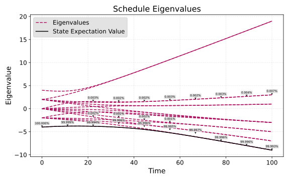
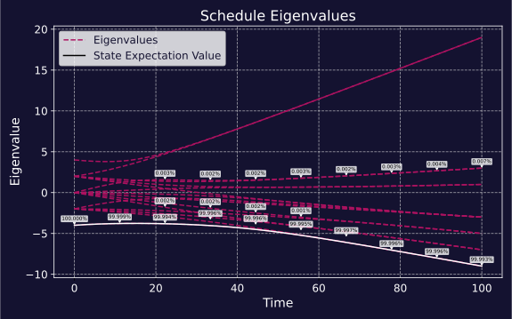

Optimization with Quantum Annealing
===================================================

In this tutorial, we will explore how to use Quantum Annealing to solve a simple
optimization problem using QiliSDK.

.. note:: If you haven't already, it might be useful to check out these tutorials first:
    :doc:`Quantum Basics </tutorials/introductions/intro_quantum>`, 
    :doc:`Quantum Circuits </tutorials/introductions/intro_circuits>` and
    :doc:`Quantum Annealing </tutorials/introductions/intro_annealing>`.

The Problem
----------------------

.. include:: ../../shared/team_building.rst

The Solution
----------------------

Now that we have our problem formulated as a QUBO, we can use quantum annealing to find an approximate solution to it.
Quantum annealing is a metaheuristic optimization algorithm that is inspired by the process of annealing
in metallurgy, where a material is heated and then slowly cooled to remove defects and find a low-energy state.
In quantum annealing, we start with a simple Hamiltonian whose ground state is easy to prepare
and then slowly evolve it into a more complex Hamiltonian that encodes the optimization problem we want to solve.
The hope is that if we do this slowly enough, the system will remain in its ground state throughout the evolution, 
and thus end up in the ground state of the final Hamiltonian, which corresponds
to the optimal solution of our problem.

Assuming we have reformulated our problem into a QUBO, we can construct the problem Hamiltonian for quantum annealing,
which is in the form:

.. math:: 

    H_{prob} = \sum_{i,j} c_{ij} Z(i) Z(j)

Where :math:`Z(i)` is the Pauli-Z operator acting on qubit :math:`i`, and :math:`c_{ij}` are the coefficients from our QUBO formulation.
Note that these variables :math:`Z(i)` are related to the binary variables in our original problem by the transformation :math:`x_i = (1 - Z(i))/2`.

Our mixing Hamiltonian is typically chosen to be the transverse field Hamiltonian, which is given by:

.. math:: 

    H_{mix} = - \sum_i X(i)

The overall time-dependent Hamiltonian that we evolve is then given by:

.. math:: 

    H(t) = A(t) H_{mix} + B(t) H_{prob}

Where :math:`A(t)` and :math:`B(t)` are functions that determine how we interpolate 
between the mixing Hamiltonian and the problem Hamiltonian over time.
For simplicity here we will just assume that we do a linear interpolation, 
such that :math:`A(t) = 1 - t/T` and :math:`B(t) = t/T`, where :math:`T` is the total annealing time.

The Implementation
----------------------

To simulate the evolution of this time-dependent Hamiltonian, first we need to form our problem:

.. include:: ../../shared/team_building_model.rst

Then we use the model to form our problem Hamiltonian, and we can also define our mixing Hamiltonian and the schedule for our evolution:

.. code-block:: python

    from qilisdk.analog import X
    from qilisdk.analog import Schedule
    from qilisdk.core import QTensor

    problem_hamiltonian = model.to_hamiltonian()
    mixer_hamiltonian = sum(-1.0 * X(i) for i in range(num_people))

We also need to define the schedule - how the coefficients of the problem and mixing Hamiltonians change over time. In this
case we'll just use a simple linear mixing:

.. code-block:: python

    schedule = Schedule.linear(mixer_hamiltonian, problem_hamiltonian, total_time=100.0, dt=0.1)

We will start in the ground state of our mixing Hamiltonian, which is the equal superposition state over all possible team assignments:

.. code-block:: python

    initial_state = QTensor.uniform(num_people)

Finally, we initialize our quantum simulator, execute the evolution, and read out the results:

.. code-block:: python

    from qilisdk.functionals import AnalogEvolution
    from qilisdk.readout import Readout
    from qilisdk.backends import QiliSim

    backend = QiliSim()
    evolution = AnalogEvolution(schedule=schedule, initial_state=initial_state)
    readout = Readout().with_sampling(1000).with_expectation([problem_hamiltonian])
    results = backend.execute(evolution, readout)
    print("Results:", results)

This will print something like the following:

.. code-block:: none

    Functional Results: [

        Sampling Results: (
                nshots=1000,
                samples={'0110': 513, '1001': 487}
        )

        Expectation Value Results: (
                expectation_values=[-8.999696720325046],
        )

    ]

As you can see from these results, the samples satisfy the constraint (i.e. have exactly two 1's). 
More specifically, the two samples "0110" and "1001" (corresponding to Alice/Dave on a team and Bob/Carol on the other team) are
the optimal solutions to our problem, with 9 being the highest obtainable compatibility score.

To help to visualize the evolution we just performed, we can re-run our simulation, 
this time recording the full state at each timestep and then using
the :meth:`Schedule.draw_eigenvalues()<qilisdk.analog.schedule.Schedule.draw_eigenvalues>` method 
to plot how our state evolved versus the eigenvalues of the Hamiltonian over time:

.. code-block:: python

    evolution = AnalogEvolution(
        schedule=schedule,
        initial_state=initial_state,
        store_intermediate_results=True
    )
    readout = Readout().with_state_tomography()
    results = backend.execute(evolution, readout)

    schedule.draw_eigenvalues(
        intermediate_states=results.get_intermediate_states(), 
        show_overlaps=True
    )

As we can see from this plot, the state started in the ground state of the mixing Hamiltonian (the bottom line, at the very left) 
and then evolved to the ground state of the problem Hamiltonian (at the very right). By moving slow enough we stayed in the ground state,
with only a small percentage of our state leaking out to some of the excited states. A larger total time (and thus a slower evolution) 
would result in less state leaking out, at the cost of taking longer to run.

Further Reading
--------------------

- `QUBO`_
- `Quantum Annealing`_

.. _QUBO: https://en.wikipedia.org/wiki/Quadratic_unconstrained_binary_optimization
.. _Quantum Annealing: https://en.wikipedia.org/wiki/Quantum_annealing
