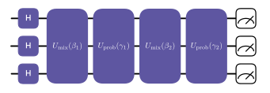
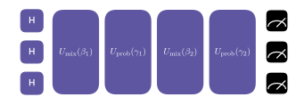

Optimization with QAOA
=======================================

In this tutorial, we will explore how to use the Quantum Approximate Optimization Algorithm (QAOA) to solve a simple
optimization problem using QiliSDK.

.. note:: If you haven't already, it might be useful to check out these tutorials first:
    :doc:`Quantum Basics </tutorials/introductions/intro_quantum>`, 
    :doc:`Quantum Circuits </tutorials/introductions/intro_circuits>` and
    :doc:`Quantum Annealing </tutorials/introductions/intro_annealing>`.

The Problem
----------------------

.. include:: ../../shared/team_building.rst

The Solution
----------------------

Now that we have our problem formulated as a QUBO, we can use QAOA to find an approximate solution to it.
QAOA is a hybrid quantum-classical algorithm that uses a parameterized quantum circuit to find
approximate solutions to combinatorial optimization problems. 
It works by alternating between applying a problem Hamiltonian (which encodes the optimization problem) 
and a mixing Hamiltonian (which helps explore the solution space), 
with the parameters of the circuit being optimized using a classical optimization algorithm.
Think of it like doing quantum annealing, except it's a digital version that switches between Hamiltonians,
rather than an analog algorithm that evolves a generic time-varying Hamiltonian.

Assuming we have reformulated our problem into a QUBO, we can construct the problem Hamiltonian for QAOA,
which is given by:

.. math:: 

    H_{prob} = \sum_{i,j} c_{ij} Z(i) Z(j)

Where :math:`Z(i)` is the Pauli-Z operator acting on qubit :math:`i`, and :math:`c_{ij}` are the coefficients from our QUBO formulation.

Our mixing Hamiltonian is typically chosen to be the transverse field Hamiltonian, which is given by:

.. math:: 

    H_{mix} = - \sum_i X(i)

Since these are Hamiltonians (rather than unitary gates), 
we need to transform them into unitaries, which is determined by the parameters of our circuit:

.. math:: 

    U_{prob}(\gamma) = e^{-i \gamma H_{prob}}

.. math:: 

    U_{mix}(\beta) = e^{-i \beta H_{mix}}

Where :math:`\gamma` and :math:`\beta` are the parameters of our circuit that we will optimize over.

We then do alternating applications of these unitaries, starting with the mixing unitary, and ending with the problem unitary.
We should also start in the ground state of the mixing Hamiltonian, which in this case is the equal superposition state.
As a circuit, this looks like the following:

Here we have only done two repeats, but we could do more or less depending on the problem.

The parameters :math:`\gamma` and :math:`\beta` are then optimized using a classical optimization algorithm,
with the objective of minimizing the expectation value of the problem Hamiltonian. What this means is that
we execute the quantum circuit, measure the output, and then use the results to adjust the parameters to 
give a better solution.

The Implementation
----------------------

In QiliSDK, a variety of classes are available to help streamline the implementation. 
Starting with the problem Hamiltonian, we can use the :class:`~qilisdk.core.model.QUBO` class to represent our QUBO problem,
and then use the :class:`~qilisdk.digital.ansatz.QAOA` class to construct the QAOA circuit and perform the optimization.

To create our model:

.. include:: ../../shared/team_building_model.rst

Then we use the model to form our QAOA ansatz (the circuit we're going to optimize):

.. code-block:: python

    from qilisdk.digital import QAOA

    problem_hamiltonian = model.to_hamiltonian()
    ansatz = QAOA(
        problem_hamiltonian=problem_hamiltonian,
        layers=2,
    )

Then we construct a variational problem (combining a classical optimizer and a quantum circuit) and simulate it:

.. code-block:: python

    from qilisdk.functionals.variational_program import VariationalProgram
    from qilisdk.functionals import DigitalPropagation
    from qilisdk.optimizers.scipy_optimizer import SciPyOptimizer
    from qilisdk.cost_functions.observable_cost_function import ObservableCostFunction
    from qilisdk.readout import Readout
    from qilisdk.backends import QiliSim

    vqa = VariationalProgram(functional=DigitalPropagation(ansatz),
                            optimizer=SciPyOptimizer(method="cobyla", tol=1e-7),
                            cost_function=ObservableCostFunction(problem_hamiltonian))

    backend = QiliSim()
    result = backend.execute(vqa, readout=Readout().with_sampling(nshots=1000))
    print("VQA Result:", result)

This gives something like the following result:

.. code-block:: none

    samples={
        '0000': 8,
        '0001': 31,
        '0010': 11,
        '0011': 42,
        '0100': 13,
        '0101': 200,
        '0110': 226,
        '0111': 18,
        '1000': 16,
        '1001': 173,
        '1010': 131,
        '1011': 2,
        '1100': 56,
        '1101': 18,
        '1110': 16,
        '1111': 39
    }

As you can see from these results, the most common samples are those which satisfy the constraint (i.e. have exactly two 1's), 
and among those, the most common ones are those which have a high objective value.

Further Reading
--------------------

- `QUBO`_
- `QAOA`_

.. _QUBO: https://en.wikipedia.org/wiki/Quadratic_unconstrained_binary_optimization
.. _QAOA: https://en.wikipedia.org/wiki/Quantum_approximate_optimization_algorithm
