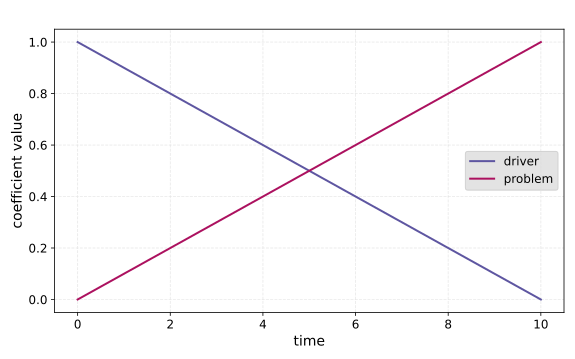
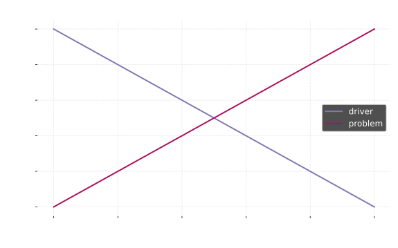

Quantum Annealing
==================================

In this tutorial, we will cover the basics of quantum annealing, and then show
how to use QiliSDK to implement a simple quantum annealing algorithm.

What is Quantum Annealing?
-----------------------------

Quantum annealing is a quantum optimization technique that is inspired by the process 
of annealing in metallurgy, where a material is heated and then slowly 
cooled to remove defects and improve its properties.

In quantum annealing, we start with a simple quantum system that is easy to prepare 
and manipulate, and then we slowly evolve it into a more complex system that 
encodes the solution to some problem we want to solve.

There is a theorem (the adiabatic theorem) that states that if we evolve our system slowly enough,
we can guarantee that it will remain in its ground state (the lowest energy state) throughout
the evolution. The speed that we need is determined by the energy gap between the ground state and the first excited state,
since if we have only a small gap between the levels we have to move slowly to make sure we don't accidentally jump up to the excited state.

What is a Hamiltonian?
--------------------------

When we talk about quantum annealing, we often talk about Hamiltonians. 
A Hamiltonian is a mathematical object that describes the energy of a quantum system.

In quantum annealing, we typically have two Hamiltonians: the initial Hamiltonian, 
which is easy to prepare and manipulate, and the final Hamiltonian, which encodes the solution to our problem.
These are combined into a single time-dependent Hamiltonian that evolves from the initial to the final Hamiltonian over time:

.. math::

    H(t) = c_i(t) H_{initial} + c_f(t) H_{final}

where :math:`c_i(t)` and :math:`c_f(t)` are time-dependent coefficients that control how the two Hamiltonians mix over time.

These Hamiltonians are typically written in terms of the Pauli operators: I, X, Y, and Z,
which are a set of matrices operating on qubits that form a basis for all possible quantum operations.
So, for example, a simple two-qubit Hamiltonian might look like:

.. math::

    H = X \otimes X - Z \otimes I

where the first term represents an interaction between the two qubits, and the second term represents a local field on the first qubit.

For simplicity, the tensor product symbol (⊗) is often omitted, and we can write the above Hamiltonian as:

.. math::
    
    H = X(0)X(1) - Z(0)

What Do We Do Once We Have a Hamiltonian?
---------------------------------------------------------------

Once we have a Hamiltonian that combines our initial and final Hamiltonians, 
we can use it to evolve our quantum system over time.
By starting our system in the ground state of the initial Hamiltonian and 
then slowly evolving it according to the time-dependent Hamiltonian, we can 
hopefully end up in the ground state of the final Hamiltonian, which encodes the solution to our problem.

Say our ground state is :math:`|ψ_0⟩`, we can represent the state of our system at the next time :math:`dt` as:

.. math:: 

    |ψ(dt)⟩ = e^{-iH(dt)dt} |ψ_0⟩

This process is repeated until we reach the end of our annealing schedule. 
Assuming the :math:`dt` is small enough, the final state of our system at the 
end of the process should be close to the ground state of the 
final Hamiltonian, which encodes the solution to our problem.

How Do We Choose Our Hamiltonians?
---------------------------------------------------------------

Determining what our initial and final Hamiltonians should be for a given optimization problem
is a non-trivial task, and there are many different techniques for doing this.
One common approach is to first represent our optimization problem as a quadratic unconstrained binary optimization (QUBO) problem,
and then to convert this QUBO problem into our final Hamiltonian. 

A common starting Hamiltonian is the transverse field Hamiltonian, which is given by:

.. math::

    H_{initial} = - \sum_i X(i)

This Hamiltonian has a simple ground state that is easy to prepare, 
which makes it a good choice for the initial Hamiltonian in quantum annealing.

There is also the choice of how you want to schedule the annealing process, 
which is determined by the functions :math:`c_i(t)` and :math:`c_f(t)`.
Choosing a good schedule can be important for the success of the annealing process, 
as it can help to ensure that we stay in the ground state throughout the evolution.
The simplest choice is a linear schedule, the coefficients of which look as follows:

How Can We Simulate Annealing With QiliSDK?
-------------------------------------------------------

.. include:: ../../shared/install_note.rst

In order to test out our quantum annealing algorithm, we can use the QiliSDK to simulate the annealing process on a classical computer.
To do this, we first create our initial and final Hamiltonians using the :doc:`Hamiltonian </modules/analog/analog_hamiltonian>` class,
or more specifically the Pauli operator classes:

.. code-block:: python

    from qilisdk.analog import X, Z

    initial_hamiltonian = - X(0) - X(1)
    final_hamiltonian = Z(0) + Z(1) + 0.5 * Z(0) * Z(1)

We then need to construct our schedule to determine how the mixing will happen over time, which we 
can do using the :doc:`Schedule </modules/analog/analog_schedule>` class. The class allows for complete
flexibility in how you want to define your schedule, but it also provides some helper functions for common schedules:

.. code-block:: python

    from qilisdk.analog import Schedule

    schedule = Schedule.linear(initial_hamiltonian, final_hamiltonian, total_time=100, dt=0.1)

We want to start in the ground state of the initial Hamiltonian, which is a uniform superposition of all possible states of the system:

.. code-block:: python

    from qilisdk.core import QTensor

    initial_state = QTensor.uniform(2)

Finally, we can use :doc:`QiliSim </modules/backends/backends_qilisim>` to simulate the annealing process:

.. code-block:: python

    from qilisdk.backends import QiliSim
    from qilisdk.functionals import AnalogEvolution
    from qilisdk.readout import Readout

    backend = QiliSim()
    result = backend.execute(
        AnalogEvolution(schedule=schedule, initial_state=initial_state), 
        Readout().with_expectation(observables=[Z(0), Z(1), Z(0) * Z(1)])
      )
    print(result.get_expectation_values())

This gives us the expectation values of the observables we specified at the end of the annealing process, 
which in this case are the terms in our final Hamiltonian:

.. code-block:: python

    [-0.9997, -0.9997, +0.9994]

These expectation values are close to the values we would expect for the ground state of our final Hamiltonian,
since to minimize the energy of the final Hamiltonian we want to minimize the values of :math:`Z(0)` and :math:`Z(1)`,
while maximizing the value of :math:`Z(0)Z(1)`. If we increase the total time and decrease the time step, 
we can get these values even closer to 1.0 and -1.0, at the cost of increasing the runtime of our simulation.

Further Reading
--------------------

- `Adiabatic Theorem`_
- `Pauli Operators`_
- `QUBO`_
- `Hamiltonian`_

.. _Adiabatic Theorem: https://en.wikipedia.org/wiki/Adiabatic_theorem
.. _Pauli Operators: https://en.wikipedia.org/wiki/Pauli_matrices
.. _QUBO: https://en.wikipedia.org/wiki/Quadratic_unconstrained_binary_optimization
.. _Hamiltonian: https://en.wikipedia.org/wiki/Hamiltonian_(quantum_mechanics)
