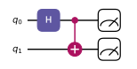
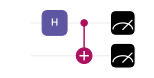

Quantum Circuits
==================================

In this tutorial, we will cover the basics of quantum circuits, which are the fundamental building blocks of quantum computation. 
We'll then also show how to use QiliSDK to build and simulate a simple quantum circuit.

What is a Quantum Circuit?
-----------------------------

In classical computing, we have *logic gates* that operate on *bits* to perform computations.
We might start with all of our bits in state 0, and then we apply a series of logic gates
(e.g. AND, OR, NOT) to manipulate those bits and perform some computation.
In quantum computing, we instead have *quantum gates* that operate on *qubits* to perform computations.

Most quantum circuits look something like the following:

In this particular case, we have a quantum circuit with 2 qubits: :math:`q_0` and :math:`q_1`. 
The horizontal lines represent the qubits, 
and the boxes and other symbols represent quantum gates that operate on those qubits.

The first gate we apply is a Hadamard gate (H) on :math:`q_0`, which puts it into a superposition of states. 
Then we apply a CNOT gate, which entangles :math:`q_0` and :math:`q_1`.
Finally, we measure both qubits.

What Are Quantum Gates?
-----------------------------

So, what exactly do these gates do? One way of representing such quantum operations is through their matrix representation.
By turning the state of our qubits into a vector, we can represent quantum gates as matrices that 
act on those vectors to produce new states.
To turn our state into a vector, we can use the computational basis, where :math:`|0⟩` is 
represented as the vector :math:`\begin{pmatrix} 1 \\ 0 \end{pmatrix}` and :math:`|1⟩` is 
represented as the vector :math:`\begin{pmatrix} 0 \\ 1 \end{pmatrix}`.

When we have multiple qubits, we can use the tensor product as mentioned in the previous tutorial to 
represent the state of the system as a vector in a higher-dimensional space.
So, if we have two qubits, we can represent the initial state :math:`|00⟩` as the vector:

.. math::
  
  |00⟩ = |0⟩ \otimes |0⟩ = \begin{pmatrix} 1 \\ 0 \end{pmatrix} \otimes \begin{pmatrix} 1 \\ 0 \end{pmatrix} = \begin{pmatrix} 1 \begin{pmatrix} 1 \\ 0 \end{pmatrix} \\ 0 \begin{pmatrix} 1 \\ 0 \end{pmatrix} \end{pmatrix} = \begin{pmatrix} 1 \\ 0 \\ 0 \\ 0 \end{pmatrix}

Our Hadamard gate (H) can be represented as the matrix:

.. math::

  H = \frac{1}{\sqrt{2}} \begin{pmatrix} 1 & 1 \\ 1 & -1 \end{pmatrix}

Now we want to do the operation :math:`H|00⟩`, but notice that our Hadamard gate is a 2x2 matrix, 
whilst our state is a 4-dimensional vector.
To apply the Hadamard gate to our two-qubit state, we first need to take the tensor product of the 
Hadamard gate with the identity matrix to create a 4x4 matrix that can 
operate on our 4-dimensional state vector. The identity matrix is:

.. math::

  I = \begin{pmatrix} 1 & 0 \\ 0 & 1 \end{pmatrix}

So, we can represent the operation of applying the Hadamard gate to the first qubit as:

.. math::

  H \otimes I = \frac{1}{\sqrt{2}} \begin{pmatrix} 1 & 0 & 1 & 0 \\ 0 & 1 & 0 & 1 \\ 1 & 0 & -1 & 0 \\ 0 & 1 & 0 & -1 \end{pmatrix}

If we finally perform the operation :math:`(H \otimes I)|00⟩`, we get:

.. math::

  (H \otimes I)|00⟩ = \frac{1}{\sqrt{2}} \begin{pmatrix} 1 \\ 0 \\ 1 \\ 0 \end{pmatrix} = \frac{1}{\sqrt{2}}(|00⟩ + |10⟩)

This is exactly what we would expect, since the Hadamard gate puts the first qubit into a superposition of states, 
while leaving the second qubit unchanged.

A similar process can be done for all different gates and combinations of gates, and this is how we can understand 
and simulate what each gate will do to our quantum state. 

Note that with a single qubit we had a vector of dimension 2, 
whilst with two qubits we have a vector of dimension 4. In general, the size of our state vector grows 
exponentially with the number of qubits, such that if we had 20 qubits then we would need vectors of size 1,048,576, 
so it should be clear why simulating quantum circuits on classical computers can 
quickly become difficult.

What Does Each Quantum Gate Do?
----------------------------------

We've just seen how the Hadamard gate behaves, but what other gates can we use in quantum circuits?
Here we list all of the most-common quantum gates, their behavior, and their matrix representations.

.. note:: Don't worry about memorizing anything here, but it's good to have a vague idea of some of the names and behaviors.

.. list-table::
   :header-rows: 1
   :widths: 10 30 30

   * - Gate Name/s
     - Description
     - Matrix Representation
   * - X
     - Flips the state of a qubit: :math:`|0⟩` to :math:`|1⟩` and :math:`|1⟩` to :math:`|0⟩`
     - :math:`\begin{pmatrix} 0 & 1 \\ 1 & 0 \end{pmatrix}`
   * - Y
     - Flips the state of a qubit and applies a phase shift: :math:`|0⟩` to :math:`i|1⟩` and :math:`|1⟩` to :math:`-i|0⟩`
     - :math:`\begin{pmatrix} 0 & -i \\ i & 0 \end{pmatrix}`
   * - Z
     - Applies a phase shift of -1 to the :math:`|1⟩` state, leaving the :math:`|0⟩` state unchanged
     - :math:`\begin{pmatrix} 1 & 0 \\ 0 & -1 \end{pmatrix}`
   * - H, Hadamard
     - Creates superpositions: :math:`|0⟩` to :math:`\frac{1}{\sqrt{2}}(|0⟩ + |1⟩)` and :math:`|1⟩` to :math:`\frac{1}{\sqrt{2}}(|0⟩ - |1⟩)`
     - :math:`\frac{1}{\sqrt{2}} \begin{pmatrix} 1 & 1 \\ 1 & -1 \end{pmatrix}`
   * - S
     - Applies a phase shift of :math:`i` to the :math:`|1⟩` state, leaving the :math:`|0⟩` state unchanged
     - :math:`\begin{pmatrix} 1 & 0 \\ 0 & i \end{pmatrix}`
   * - T
     - Applies a phase shift of :math:`e^{i\pi/4}` to the :math:`|1⟩` state, leaving the :math:`|0⟩` state unchanged
     - :math:`\begin{pmatrix} 1 & 0 \\ 0 & e^{i\pi/4} \end{pmatrix}`
   * - RX
     - A single-qubit rotation around the X-axis of the Bloch sphere by an angle :math:`θ`
     - :math:`\begin{pmatrix} \cos(\frac{θ}{2}) & -i\sin(\frac{θ}{2}) \\ -i\sin(\frac{θ}{2}) & \cos(\frac{θ}{2}) \end{pmatrix}`
   * - RY
     - A single-qubit rotation around the Y-axis of the Bloch sphere by an angle :math:`θ`
     - :math:`\begin{pmatrix} \cos(\frac{θ}{2}) & -\sin(\frac{θ}{2}) \\ \sin(\frac{θ}{2}) & \cos(\frac{θ}{2}) \end{pmatrix}`
   * - RZ
     - A single-qubit rotation around the Z-axis of the Bloch sphere by an angle :math:`θ`
     - :math:`\begin{pmatrix} e^{-i\frac{θ}{2}} & 0 \\ 0 & e^{i\frac{θ}{2}} \end{pmatrix}`
   * - CNOT, CX
     - A two-qubit gate that flips the second qubit if the first qubit is :math:`|1⟩`
     - :math:`\begin{pmatrix} 1 & 0 & 0 & 0 \\ 0 & 1 & 0 & 0 \\ 0 & 0 & 0 & 1 \\ 0 & 0 & 1 & 0 \end{pmatrix}`
   * - CZ
     - A two-qubit gate that applies a phase shift of -1 to the :math:`|11⟩` state, leaving the other states unchanged
     - :math:`\begin{pmatrix} 1 & 0 & 0 & 0 \\ 0 & 1 & 0 & 0 \\ 0 & 0 & 1 & 0 \\ 0 & 0 & 0 & -1 \end{pmatrix}`
   * - SWAP
     - A two-qubit gate that swaps the states of the two qubits
     - :math:`\begin{pmatrix} 1 & 0 & 0 & 0 \\ 0 & 0 & 1 & 0 \\ 0 & 1 & 0 & 0 \\ 0 & 0 & 0 & 1 \end{pmatrix}`
   * - Generic Controlled Gates
     - A controlled version of a generic gate U, such that U acts on the second qubit only if the first qubit is :math:`|1⟩`
     - :math:`\begin{pmatrix} 1 & 0 & 0 & 0 \\ 0 & 1 & 0 & 0 \\ 0 & 0 & U_{00} & U_{01} \\ 0 & 0 & U_{10} & U_{11} \end{pmatrix}`
   * - Toffoli
     - A three-qubit gate that flips the third qubit if the first two qubits are both :math:`|1⟩`
     - :math:`\begin{pmatrix} 1 & 0 & 0 & 0 & 0 & 0 & 0 & 0 \\ 0 & 1 & 0 & 0 & 0 & 0 & 0 & 0 \\ 0 & 0 & 1 & 0 & 0 & 0 & 0 & 0 \\ 0 & 0 & 0 & 1 & 0 & 0 & 0 & 0 \\ 0 & 0 & 0 & 0 & 1 & 0 & 0 & 0 \\ 0 & 0 & 0 & 0 & 0 & 1 & 0 & 0 \\ 0 & 0 & 0 & 0 & 0 & 0 & 0 & 1 \\ 0 & 0 & 0 & 0 & 0 & 0 & 1 & 0 \end{pmatrix}`

How Can We Simulate These Circuits?
-----------------------------------------

.. include:: ../../shared/install_note.rst

Now that we have an understanding of what quantum circuits are and what quantum gates do, 
we can use QiliSDK to build and simulate our own quantum circuits.
To create a quantum circuit in QiliSDK, we can use the :doc:`Circuit </modules/digital/digital_circuits>` class:

.. code-block:: python

   from qilisdk.digital import Circuit

   circuit = Circuit(2)

This creates a quantum circuit with 2 qubits. We can then add gates to our circuit:

.. code-block:: python

   from qilisdk.digital import H, CNOT

   circuit.add(H(0))
   circuit.add(CNOT(0, 1))

And finally we should also add some measurements:

.. code-block:: python

   from qilisdk.digital import M

   circuit.add(M(0))
   circuit.add(M(1))

This results in the circuit we showed at the beginning of this tutorial, 
which creates a superposition on the first qubit, 
entangles it with the second qubit, and then measures both qubits.

If we want to simulate this circuit, we can use the :doc:`QiliSim </modules/backends/backends_qilisim>` backend.
To tell the simulator that we want to simulate a circuit we use the
the :doc:`DigitalPropagation </modules/functionals/functionals_sampling>` class 
and then use the :doc:`Readout </modules/readout/readout>` class to specify how we want to read out our results:

.. code-block:: python

   from qilisdk.backends import QiliSim
   from qilisdk.functionals import DigitalPropagation
   from qilisdk.readout import Readout

   backend = QiliSim()
   result = backend.execute(DigitalPropagation(circuit), Readout().with_sampling(nshots=100))
   print(result.get_samples())

This will execute our circuit on the QiliSim simulator, as though we ran 
our quantum circuit 100 times and recorded all of our measurements.
The output of this will be a dictionary of samples, where each key is a string representing the 
measurement outcomes for each qubit, and each value is the number of times that outcome was observed:

.. code-block:: python

   {
   '00': 49,
   '11': 51
   }

As you can see, we get approximately equal numbers of '00' and '11' outcomes, 
which is what we would expect from our circuit. Note that it's not exactly 50/50 since
we are sampling from a random distribution, but as we increase the number of samples 
we should see it get closer and closer to 50/50.

Here we have just used a simulator to execute our circuit, but we could also execute it on a real quantum computer. 
To do this, you can use SpeQtrum, the system for accessing the Qilimanjaro quantum hardware, which is available through QiliSDK. 
You can find more information about how to do this in the :doc:`SpeQtrum </modules/speqtrum/speqtrum>` module guide.

Further Reading
--------------------

- `Quantum Circuit`_
- `Quantum Gate`_
- `List of Quantum Gates`_

.. _Quantum Circuit: https://en.wikipedia.org/wiki/Quantum_circuit
.. _Quantum Gate: https://en.wikipedia.org/wiki/Quantum_gate
.. _List of Quantum Gates: https://en.wikipedia.org/wiki/List_of_quantum_logic_gates
