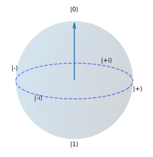
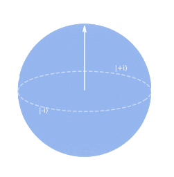

Quantum Basics
=====================================

In this tutorial, we'll cover the basic things you'll need to know about quantum physics in order to 
start using quantum computing and quantum annealing. If you have any experience at
all with anything quantum, you probably don't need this tutorial.

What Does Quantum Mean?
-----------------------------

Quantum refers to the fact that in quantum physics, certain properties of particles (like energy, position, and spin) 
can only take on discrete values, or "quanta". This is in contrast to classical physics, where these properties 
can vary continuously. The quantum nature of particles leads to phenomena that are fundamentally different from classical physics,
which in some cases allows for new capabilities that are not possible with classical computers.

What is Quantum Advantage?
-----------------------------

The term "quantum advantage" refers to the potential for quantum computers to solve certain problems more efficiently than classical computers.
This is often discussed in the context of specific algorithms, such as Shor's algorithm for factoring large 
numbers, which can run exponentially faster on a quantum computer than the best known classical algorithms.

Quantum advantage has been demonstrated for certain specific problems, but 
it is still an open question as to how broadly it can be applied. It is likely that quantum computers will be able to provide 
huge advantages for some very specific types of problems, whilst offering more modest advantage in the general case.

There is also the consideration that quantum computers tend to be more energy-efficient than classical computers, at least in the theoretical
limit, so even if they don't provide a speed advantage for a particular problem, they may still be advantageous in terms of energy consumption.

What is a Qubit?
-----------------------------

The simplest and most fundamental unit of quantum information is the qubit, which is the quantum analogue of a classical bit. 
A classical bit can only be in one of two states, 0 or 1, but a qubit can be in a mix of both states at the same time.

Whilst it is possible to choose any "basis" to represent a qubit, the most common is the computational basis, where our two 
main states are denoted as :math:`|0⟩` and :math:`|1⟩`. This is known as "bra-ket" notation, and is a common way to represent quantum states.
So, say in our system we have a single qubit, we might write our quantum state :math:`|ψ⟩` as either:

:math:`|ψ⟩ = |0⟩` (the qubit is in the state 0)

:math:`|ψ⟩ = |1⟩` (the qubit is in the state 1)

If we instead want to use matrix notation, we can represent these states as column vectors:

:math:`|0⟩ = \begin{pmatrix} 1 \\ 0 \end{pmatrix}`

:math:`|1⟩ = \begin{pmatrix} 0 \\ 1 \end{pmatrix}`

What is Superposition?
-----------------------------

Superposition is a fundamental concept in quantum mechanics, where a qubit can exist as both :math:`|0⟩` and :math:`|1⟩` at the same time. 
This is represented mathematically as a linear combination of the basis states. For example, a qubit in superposition can be written as:

:math:`|ψ⟩ = α|0⟩ + β|1⟩`

where :math:`α` and :math:`β` are complex numbers that represent the probability amplitudes of the qubit being in the states 0 and 1, respectively.
Similarly, in matrix notation we can represent this state as:

:math:`|ψ⟩ = \begin{pmatrix} α \\ β \end{pmatrix}`

When we measure a qubit in such a superposition, we will get 0 with probability :math:`|α|^2` and 1 with probability :math:`|β|^2`. 
As such the probability amplitudes must be normalized so that :math:`|α|^2 + |β|^2 = 1` to ensure that we have a valid probability distribution.

What Happens if We Have More Than One Qubit?
-----------------------------------------------

When we have more than one qubit, we can represent the state of the system as a tensor product 
of the individual qubits, which we usually write by placing the states of the individual qubits next to each other. 
For example, if we have two qubits, we can represent their general state as:

:math:`|ψ⟩ = α|00⟩ + β|01⟩ + γ|10⟩ + δ|11⟩`

where :math:`α`, :math:`β`, :math:`γ`, and :math:`δ` are the probability amplitudes for each of the four possible states of the two qubits,
which again should be normalized so that we have a valid set of probabilities to measure each state.

When we switch to matrix notaton we will need to perform the tensor product 
of the individual qubits to get a 4-dimensional vector that represents the state of the two-qubit system, for example:

:math:`|00⟩ = |0⟩ \otimes |0⟩ = \begin{pmatrix} 1 \\ 0 \end{pmatrix} \otimes \begin{pmatrix} 1 \\ 0 \end{pmatrix} = \begin{pmatrix} 1 \begin{pmatrix} 1 \\ 0 \end{pmatrix} \\ 0 \begin{pmatrix} 1 \\ 0 \end{pmatrix} \end{pmatrix} = \begin{pmatrix} 1 \\ 0 \\ 0 \\ 0 \end{pmatrix}`

So our general two-qubit state in matrix notation would be:

:math:`|ψ⟩ = α\begin{pmatrix} 1 \\ 0 \\ 0 \\ 0 \end{pmatrix} + β\begin{pmatrix} 0 \\ 1 \\ 0 \\ 0 \end{pmatrix} + γ\begin{pmatrix} 0 \\ 0 \\ 1 \\ 0 \end{pmatrix} + δ\begin{pmatrix} 0 \\ 0 \\ 0 \\ 1 \end{pmatrix} = \begin{pmatrix} α \\ β \\ γ \\ δ \end{pmatrix}`

What is Entanglement?
-----------------------------

If we now have more than one qubit, we can also have a phenomenon called entanglement, where the state of one qubit is dependent on the state of another qubit.
Imagine we have two qubits, and we prepare them in the state:

:math:`|ψ⟩ = \frac{1}{\sqrt{2}}(|00⟩ + |11⟩)`

If we were to measure the first qubit and we saw that it was in the state 0, then we would immediately know that 
the second qubit is also in the state 0. Similarly for state 1. This is because the two qubits are entangled, and their states 
are correlated in such a way that the state of one qubit cannot be described independently of the state of the other qubit.

This quantum entanglement is a key resource for quantum physics, as when combined with superposition it can allow for quantum algorithms 
that can solve certain problems more efficiently than classical algorithms.

How Can We Visualize a Qubit?
-------------------------------

For a single qubit, we can visualize the state of the qubit using the Bloch sphere, 
which is a unit sphere where any point on the surface of the sphere represents a valid quantum state of the qubit.

To do so, we can represent the state of the qubit in terms of two angles, :math:`θ` and :math:`φ`, calculated
from the probability amplitudes :math:`α` and :math:`β` as follows:

:math:`θ = 2 \arccos(|α|)`

:math:`φ = \arg(β) - \arg(α)`

We can then plot the point corresponding to these angles on the surface of the Bloch sphere, 
which gives us a visual representation of the state of the qubit:

Further Reading
--------------------

- `Qubit`_
- `Bra-Ket Notation`_
- `Superposition`_
- `Entanglement`_
- `Quantum Advantage`_

.. _Quantum Advantage: https://en.wikipedia.org/wiki/Quantum_advantage
.. _Superposition: https://en.wikipedia.org/wiki/Quantum_superposition
.. _Entanglement: https://en.wikipedia.org/wiki/Quantum_entanglement
.. _Qubit: https://en.wikipedia.org/wiki/Qubit
.. _Bra-Ket Notation: https://en.wikipedia.org/wiki/Bra%E2%80%93ket_notation
